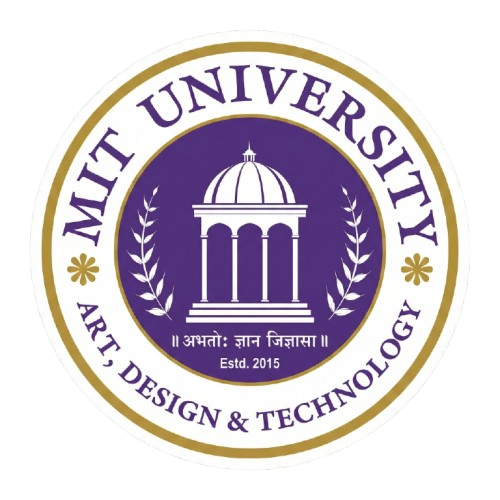

<h1 align="left">
  
  MIT-ADT Boat Club
</h1>

<div align="center">


**Official Website of MIT-ADT Boat Club, Pune**

[](https://nextjs.org/)
[](https://www.typescriptlang.org/)
[](https://www.mongodb.com/)
[](https://tailwindcss.com/)

</div>

---

## 📌 About

MIT-ADT Boat Club is Pune's premier collegiate rowing club under MIT ADT University. This is the official website built to showcase achievements, manage athletes, events, and news — with a powerful admin dashboard.

---

## 🖥️ Live Preview

> 🔗 Coming Soon — Deploying on Vercel

---

## ✨ Features

### 👥 User Side
- 🏠 **Hero Section** — Beautiful landing with boat club background
- 📰 **Latest News** — Featured news managed by admin
- 🖼️ **Photo Gallery** — Slideshow + full gallery with category filter
- 🚣 **Athlete Profiles** — View all athletes with medal tally
- 🏆 **Results** — Year-wise results with category tabs (State, National, AIU, VSM etc.)
- 👨‍🏫 **Coaches** — Coach and boatman profiles
- 📅 **Events** — Signature and annual events
- 🎯 **Achievements** — Best Sports Person Award + Athletes in Service
- 📝 **Join the Club** — Form submission via WhatsApp

### 🔐 Admin Dashboard
- Secure login with JWT authentication
- Manage **News** — Add, Edit, Delete, Feature
- Manage **Results** — Year/Category wise
- Manage **Athletes** — Full profiles with medals
- Manage **Events** — Add and update events
- Manage **Gallery** — Upload photos via Cloudinary

---

## 🛠️ Tech Stack

| Layer | Technology |
|---|---|
| Frontend | Next.js 16, TypeScript, Tailwind CSS |
| Animations | Framer Motion |
| Icons | Lucide React |
| Backend | Node.js, Express.js |
| Database | MongoDB Atlas |
| Image Storage | Cloudinary |
| Authentication | JWT |
| Fonts | Bebas Neue, Inter |

---

## 🚀 Getting Started

### Prerequisites
- Node.js 18+
- MongoDB Atlas account
- Cloudinary account

### Installation

```bash
# Clone the repository
git clone https://github.com/sanjyotdhamal/MIT-ADT-Boat-Club.git
cd MIT-ADT-Boat-Club

# Install frontend dependencies
npm install

# Install backend dependencies
cd backend
npm install
```

### Environment Setup

Create `backend/.env`:

```env
MONGODB_URI=your_mongodb_connection_string
JWT_SECRET=your_jwt_secret
PORT=5000
CLOUDINARY_CLOUD_NAME=your_cloud_name
CLOUDINARY_API_KEY=your_api_key
CLOUDINARY_API_SECRET=your_api_secret
```

### Running the Project

```bash
# Terminal 1 - Frontend
npm run dev

# Terminal 2 - Backend
cd backend
node server.js
```

Open [http://localhost:3000](http://localhost:3000) in browser.

### Admin Setup (First Time)

```bash
curl -X POST http://localhost:5000/api/auth/setup
```

---

## 📁 Project Structure

```text
mit-boat-club/
├── src/
│   ├── app/                    # Next.js pages
│   │   ├── about/
│   │   ├── admin/              # Admin dashboard
│   │   ├── athletes/
│   │   ├── events/
│   │   ├── gallery/
│   │   ├── news/
│   │   ├── results/
│   │   └── join/
│   ├── components/
│   │   ├── admin/              # Shared admin components
│   │   ├── layout/             # Navbar, Footer
│   │   └── sections/           # Hero, Gallery, Athletes etc.
│   └── lib/                    # Utility functions
├── backend/
│   ├── models/                 # MongoDB schemas
│   ├── routes/                 # API endpoints
│   ├── middleware/             # JWT auth
│   ├── config/                 # Cloudinary config
│   └── server.js
└── public/
    └── images/
```
---

## 🤝 Contributing

This project is built for MIT-ADT Boat Club, Pune. For any changes or improvements, please contact the development team.

---

## 📄 License

This project is proprietary and built exclusively for MIT-ADT Boat Club.

---

<div align="center">

Made with ❤️ for **MIT-ADT Boat Club, Pune**

</div>